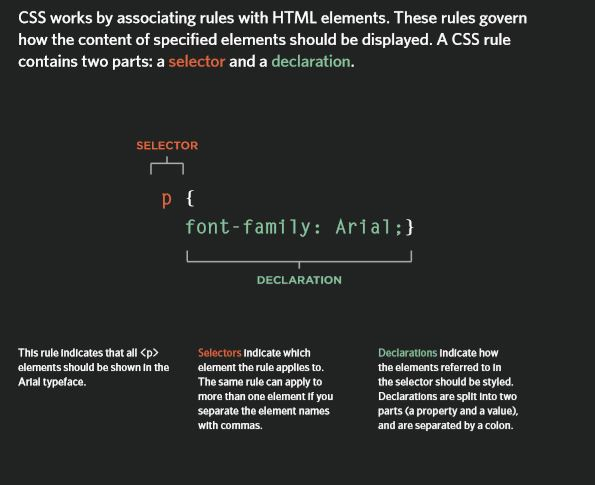

## The markup text that may appear in HTML page  

1. **Structural markup**: the elements that you can use to describe both headings and paragraphs
1. **Semantic markup**: which provides extra information; such as where emphasis is placed in a sentence, that something you have written is a quotation (and who said it), the meaning of acronyms, and so on.

 **Structuaral Markup:**
```
* <p> paragraph
* <i> italic
* <b> bold
* <br> new line

```

 **Semantic Markup:**
```
<strong>
<q>
<address>
<defn>
<strong>
<em>

```

## CSS associates Style rules with htML elements
  

## You can link HTML to CSS using in two different ways:
* external css:

```
<link>
The <link> element can be used in an HTML document to tell the browser where to find the CSS file used to style the page. It is an empty element (meaning it does not need a closing tag), and it lives inside the <head> element. It should use three attributes:

href
type
rel

```
## CSS Selectors:
There are many different types of CSS selector that allow you to target rules to specific elements in an HTML document. 
The table on the opposite page introduces the most commonly used CSS selectors.
On this page, there is an HTML file to demonstrate which elements these CSS selectors would apply to.


## Javascript Instructions:
* Statements
A script is a series of instructions that a computer can follow one-by-one. Each individual instruction or step is known as a statement. Statements should end with a semicolon.

* Comments
You should write comments to explain what your code does. They help make your code easier to read and understand. This can help you and others who read your code.

* Variable:
A script will have to temporarily store the bits of information it needs to do its job. It can store this data in variables.
A variable is a good name for this concept because the data stored in a variable can change (or vary) each time a script runs.

### How to declare a variable:


### Data types:


### Naming the variables:


### ARRAYS
An array is a special type of variable. It doesn't just store one value; it stores a list of values. 
You create an array and give it a name just like you would any other variable (using the var keyword followed by the name of the array). 
The values are assigned to the array inside a pair of square brackets, and each value is separated by a comma. The values in the array do not need to be the same data type, so you can store a string, a number and a Boolean all in the same array. 

### Logical Operators


